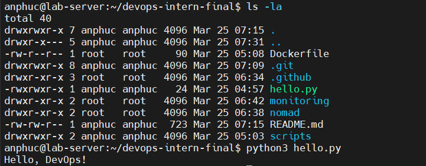
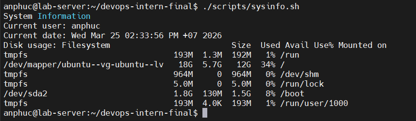
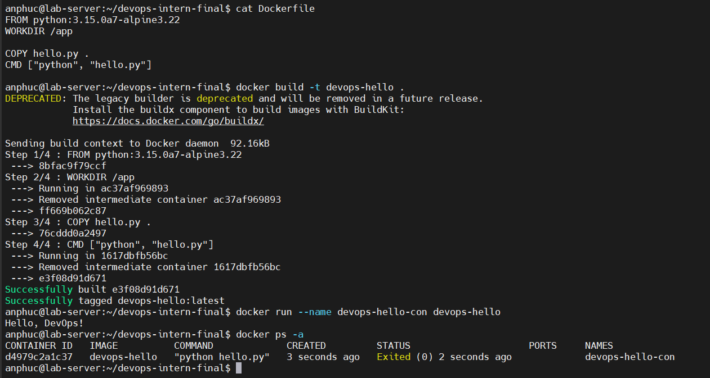
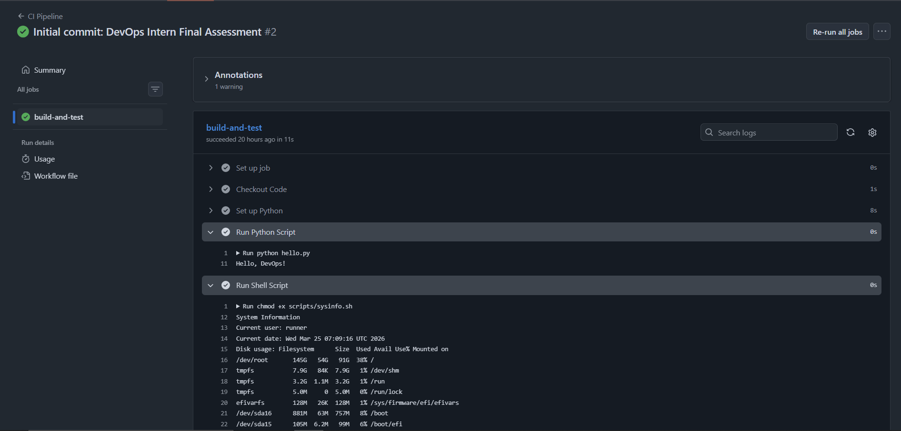
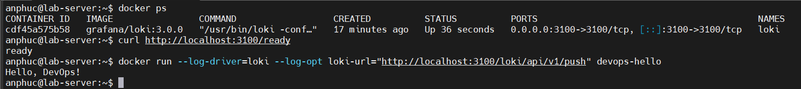

# DevOps Intern Final Assessment

**Author:** Nguyen An Phuc \
**Date:** March 25, 2026 \
**Project Description:** A complete DevOps workflow demonstration including Linux scripting, Docker containerization, GitHub Actions (CI/CD), HashiCorp Nomad deployment, and Grafana Loki monitoring setup.

👉 [CI Pipeline](https://github.com/Bel7phegor/devops-intern-final/actions/runs/23529074474)

## Steps to Run

### 1. Run Python Script
* **File python here:** [hello.py](hello.py)

	```
	python3 hello.py
	```
	<p align="center">
	
	</p>

### 2. Run Sysinfo Script
* **Sysinfo Script here:** [scripts/sysinfo.sh](scripts/sysinfo.sh)

	```
	chmod +x scripts/sysinfo.sh
	./scripts/sysinfo.sh
	```
	<p align="center">
	
	</p>

### 3. Docker Build & Run
* **Dockerfile here:** [Dockerfile](Dockerfile)
	```
	docker build -t devops-hello .
	docker run devops-hello
	docker ps -a
	```
	<p align="center">
	
	</p>
### 4. CI/CD with GitHub Actions
* **File:** [.github/workflows/ci.yml](.github/workflows/ci.yml)

	<p align="center">
	
	</p>

### 5. Run Nomad Job
* **File nomad here:** [nomad/hello.nomad](./nomad/hello.nomad)

	> Run Use: **nomad job run nomad/hello.nomad**

### 6. Monitoring with Grafana Loki
* **File setup Loki:** [monitoring/loki_setup.txt](monitoring/loki_setup.txt)

	<p align="center">
	
	</p>

### 7. MLFlow 
* **File:** [mlflow/dummy_experiment.py](mlflow/dummy_experiment.py)
